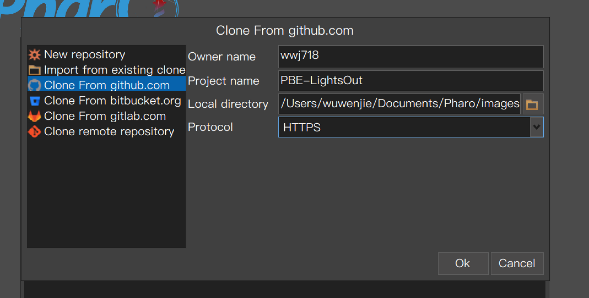
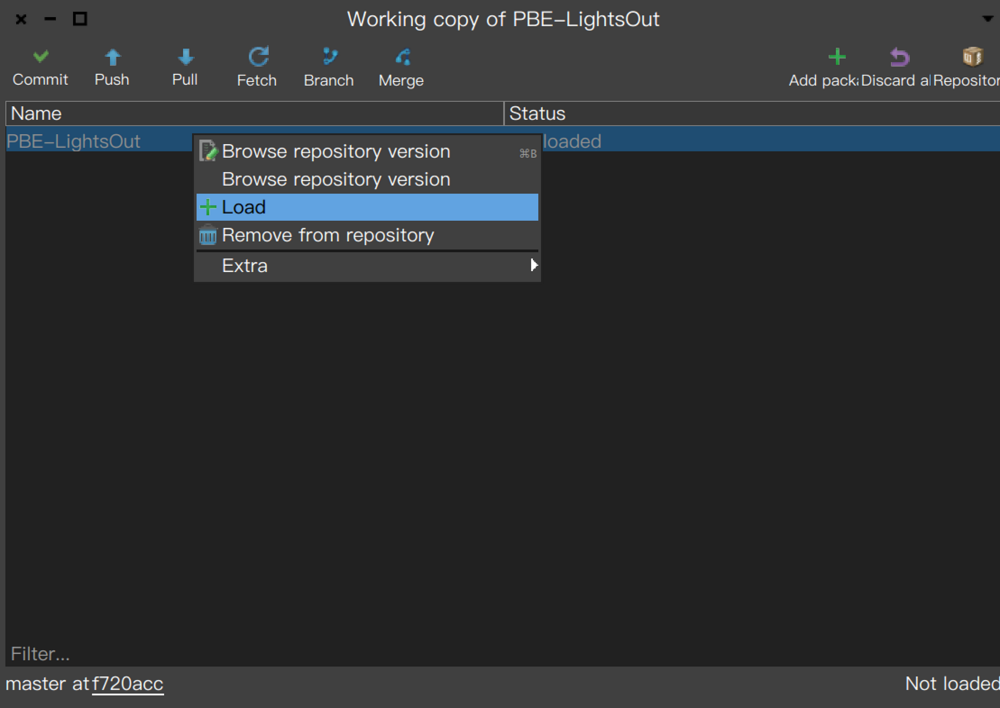
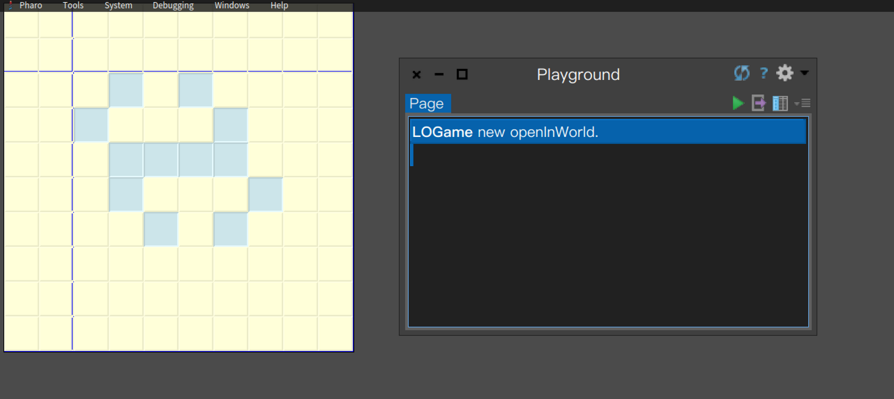

# PBE-LightsOut
[Lights Out game](https://ci.inria.fr/pharo-contribution/job/UpdatedPharoByExample/lastSuccessfulBuild/artifact/book-result/FirstApplication/FirstApplication.html) with Pharo

# Install
work with Iceberg : [Iceberg Tutorial](https://github.com/pharo-vcs/iceberg/wiki/Tutorial)






# Usage
open a Playground:

```smalltalk
LOGame new openInWorld. 
```

do it!


